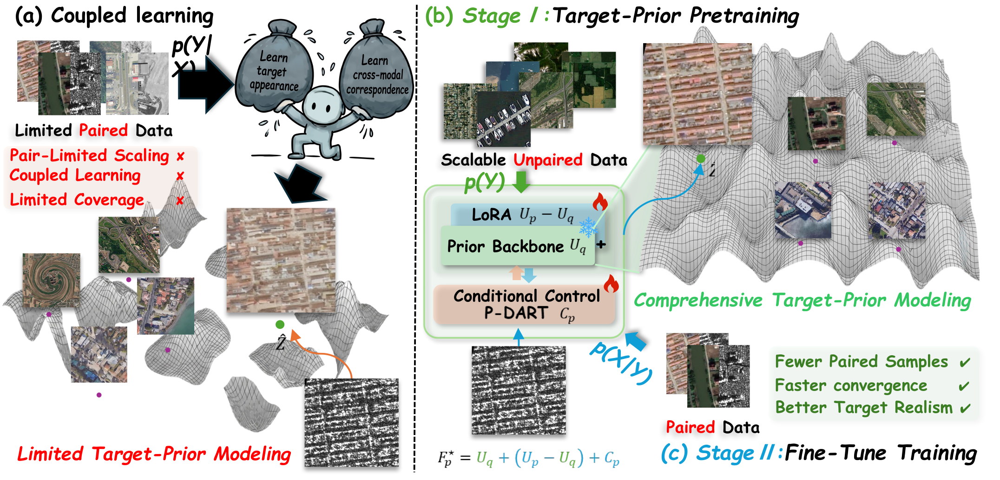
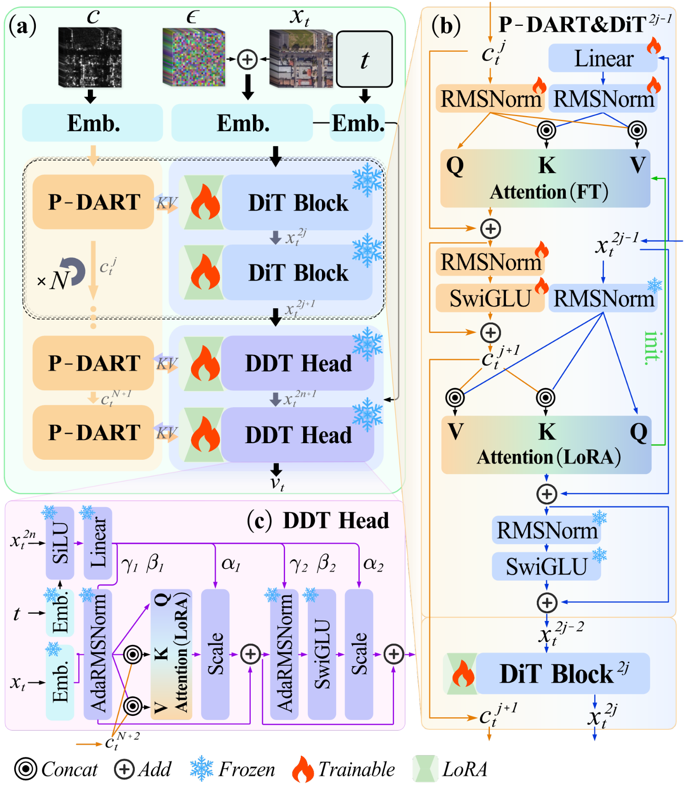
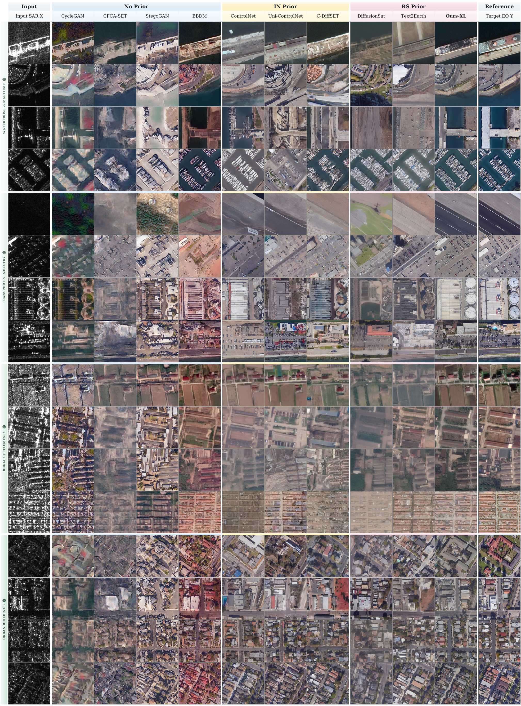

<h1 align="center">Learning the Target Priors Before Image Translation</h1>

<p align="center">
  <strong>A Decoupled Training Paradigm for Cross-Modal Image Translation in Remote Sensing</strong>
</p>

<p align="center">
  <a href="https://orcid.org/0000-0003-0168-5606">Keyan Hu</a><sup>1*</sup>,
  <a href="https://orcid.org/0009-0007-6068-4829">Mingtao Wang</a><sup>1*</sup>,
  <a href="https://orcid.org/0009-0006-1527-5703">Ziyu Zhou</a><sup>2</sup>,
  <a href="https://orcid.org/0000-0002-3828-3080">Tiandong Shi</a><sup>1</sup>,
  <a href="https://orcid.org/0000-0003-1173-6593">Haifeng Li</a><sup>1</sup>,
  <a href="https://orcid.org/0000-0001-7948-579X">Ji Qi</a><sup>3&dagger;</sup>,
  <a href="https://orcid.org/0000-0003-0071-310X">Chao Tao</a><sup>1&dagger;</sup>
</p>

<p align="center">
  <sup>1</sup> Central South University &nbsp;&nbsp;
  <sup>2</sup> Wuhan University &nbsp;&nbsp;
  <sup>3</sup> Guangzhou University
</p>

<p align="center">
  <sup>*</sup> Equal contribution &nbsp;&nbsp; <sup>&dagger;</sup> Corresponding authors
</p>

<p align="center">
  <a href="https://arxiv.org/abs/2608.28517"></a>
  <a href="https://keyanhu-git.github.io/LTP-BIT/"></a>
  <a href="https://github.com/KeyanHu-git/LTP-BIT"></a>
</p>

##  Overview

Remote-sensing cross-modal translation has to solve two different problems at once: learning what realistic target images look like, and learning how a source observation should control the generated result. Standard paired training learns both from the same limited set of aligned samples.

LTP-BIT separates them. It first learns a target-domain generative prior from scalable, unpaired RGB imagery. The pretrained backbone is then kept fixed while P-DART learns source-conditioned control from paired data. This prior-first design lets the model spend unpaired data on target realism and reserve paired samples for cross-modal correspondence.

<p align="center">
  
</p>

Our experiments cover single-polarization SAR-to-RGB, multi-polarization SAR-to-RGB, and NIR-to-RGB translation. The final model uses 9.81% task-specific parameters. On QXS-SAROPT, it retains near-full-data instance fidelity with 25% of the paired training samples.

##  Model architecture

### P-DART: controlling a fixed target prior

P-DART controls a pretrained DiT without rewriting the target prior learned from unpaired RGB images. It adds a trainable reference stream for the source image. At each block, asymmetric attention passes information from this stream into the frozen generation stream. During paired training, only P-DART and the backbone LoRA adapters are updated; the DiT backbone and DDT head stay fixed.

<p align="center">
  
</p>

| Component | Role during paired adaptation | Updated? |
| --- | --- | :---: |
| Target-prior backbone | Carries the target-domain generative field learned from unpaired RGB images | No |
| P-DART reference stream | Reads the source modality and injects source-dependent control | Yes |
| Backbone LoRA | Corrects the remaining mismatch between the pretrained prior and task target | Yes |
| DDT head | Decodes the adapted latent representation | No |

##  Results

We evaluate LTP-BIT on three sensor pairs: single-polarization SAR to RGB, multi-polarization SAR to RGB, and NIR to RGB. Higher PSNR and SSIM indicate closer instance reconstruction. Lower LPIPS, FID, and CMMD indicate smaller perceptual or distributional differences.

<div align="center">
<table align="center">
  <thead>
    <tr>
      <th align="center">Benchmark</th>
      <th align="center">Translation</th>
      <th align="center">PSNR ↑</th>
      <th align="center">SSIM ↑</th>
      <th align="center">LPIPS ↓</th>
      <th align="center">FID ↓</th>
      <th align="center">CMMD ↓</th>
    </tr>
  </thead>
  <tbody>
    <tr>
      <td align="center">QXS-SAROPT</td>
      <td align="center">single-pol. SAR → RGB</td>
      <td align="center">15.956</td>
      <td align="center">0.351</td>
      <td align="center"><strong>0.446</strong></td>
      <td align="center"><strong>16.54</strong></td>
      <td align="center"><strong>0.201</strong></td>
    </tr>
    <tr>
      <td align="center">SpaceNet6</td>
      <td align="center">multi-pol. SAR → RGB</td>
      <td align="center"><strong>18.924</strong></td>
      <td align="center"><strong>0.353</strong></td>
      <td align="center"><strong>0.293</strong></td>
      <td align="center">43.76</td>
      <td align="center">0.808</td>
    </tr>
    <tr>
      <td align="center">Chesapeake</td>
      <td align="center">NIR → RGB</td>
      <td align="center">17.717</td>
      <td align="center">0.350</td>
      <td align="center"><strong>0.290</strong></td>
      <td align="center"><strong>18.19</strong></td>
      <td align="center">0.825</td>
    </tr>
  </tbody>
  <tfoot>
    <tr>
      <td align="center" colspan="7"><sub><em>Bold values mark the best result among the methods compared in the paper.</em></sub></td>
    </tr>
  </tfoot>
</table>
</div>

<p align="center">
  
</p>

<p align="center"><sub>Extended qualitative comparisons on QXS-SAROPT, grouped by scene type. See the paper for metric definitions and ablations.</sub></p>

## Getting started

Use Linux, Python 3.10, and NVIDIA GPUs with BF16 support. Our paper experiments ran on four NVIDIA RTX A6000 GPUs.

```bash
git clone https://github.com/KeyanHu-git/LTP-BIT.git
cd LTP-BIT

conda create -n ltp-bit python=3.10 -y
conda activate ltp-bit
pip install -r requirements.txt
```

The requirements file pins PyTorch 2.8.0 and torchvision 0.23.0. Before starting a multi-GPU run, check that your driver and CUDA runtime support this PyTorch build.

## Data & checkpoints

The paired-data loader matches source and target images by relative path. If either side of a pair is missing, the loader raises an error instead of dropping the sample.

| Dataset | Train | Test | Expected folders |
| --- | ---: | ---: | --- |
| QXS-SAROPT | 16,000 | 4,000 | `{train,test}/{sar,opt}` |
| SpaceNet6 | 20,168 | 5,048 | `{train,test}/{sar,opt}` |
| Chesapeake | 16,000 | 4,000 | `{train,test}/{nir,rgb}` |

Stage 2 uses RS-1M for target-prior pretraining. We selected one million 256 x 256 RGB images from Git-10M, screened low-quality samples, removed duplicates, and kept the final set diverse. The supplement describes the selection procedure.

Checkpoint files are not stored in Git. Download links will be added after the release package has been checked and uploaded; the expected folder names and paths are listed in the [reproduction guide](docs/REPRODUCING.md).

##  Release status

The code is public, but pretrained weights are not included in the current release. We will update this list as the repository changes.

- [x] Training, inference, and evaluation code
- [x] Reproduction configs for all three benchmarks
- [ ] Pretrained LTP-BIT checkpoints
- [ ] Additional examples and usage notes
- [ ] Compatibility fixes for future dependency updates

## Training

Training runs in three steps: codec adaptation, target-prior pretraining, then paired P-DART adaptation. For QXS-SAROPT, the final step is launched with:

```bash
bash scripts/raev2/stage3/train.sh \
  configs/raev2/stage3/train/qxslab_saropt/igxl_s2git1m_ep100_mmdit_encdec_ep80.yaml \
  0,1,2,3
```

Stage 3 expects the adapted decoder and pretrained target prior named in its YAML file. See the [reproduction guide](docs/REPRODUCING.md) for Stages 1 and 2, alternate datasets, and resume options.

## Inference

Set `CKPT` to a trained Stage 3 checkpoint. The test script generates samples and computes the configured metrics.

```bash
CKPT=weights/stage3/qxslab_saropt/igxl_ltp_bit_ep80.pt \
bash scripts/raev2/stage3/test.sh \
  configs/raev2/stage3/test/qxslab_saropt/test_igxl_s2git1m_ep100_mmdit_encdec_ep80.yaml \
  0,1,2,3
```

SpaceNet6 and Chesapeake use the corresponding YAML files under `configs/raev2/stage3/test/`. Outputs are saved to the experiment directory set in the selected config.

## Citation

If this code or paper helps your work, please cite:

```bibtex
@article{hu2026ltpbit,
  title   = {Learning the Target Priors Before Image Translation:
             A Decoupled Training Paradigm for Cross-Modal Image
             Translation in Remote Sensing},
  author  = {Hu, Keyan and Wang, Mingtao and Zhou, Ziyu and Shi, Tiandong and
             Li, Haifeng and Qi, Ji and Tao, Chao},
  journal = {arXiv preprint arXiv:2608.28517},
  year    = {2026}
}
```

## Acknowledgements

Thanks to the authors of [RAE](https://github.com/bytetriper/RAE), [RAEv2](https://github.com/nanovisionx/RAEv2), and [DINOv3](https://github.com/facebookresearch/dinov3) for their models and code, and to the teams behind [Git-10M](https://github.com/Chen-Yang-Liu/Text2Earth), [QXS-SAROPT](https://github.com/yaoxu008/QXS-SAROPT), [SpaceNet6](https://spacenet.ai/sn6-challenge/), and [Chesapeake Land Cover](https://lila.science/datasets/chesapeakelandcover/) for making the datasets available.
